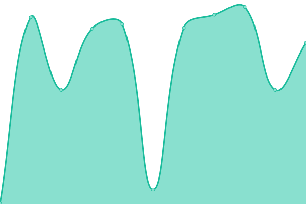

# [📈 Live Status](https://status.srueg.ch): <!--live status--> **🟩 All systems operational**

This repository contains the open-source uptime monitor and status page for [Simon Rüegg](https://status.srueg.ch), powered by [Upptime](https://github.com/upptime/upptime).

With [Upptime](https://upptime.js.org), you can get your own unlimited and free uptime monitor and status page, powered entirely by a GitHub repository. We use [Issues](https://github.com/srueg/upptime/issues) as incident reports, [Actions](https://github.com/srueg/upptime/actions) as uptime monitors, and [Pages](https://status.srueg.ch) for the status page.

<!--start: status pages-->
<!-- This summary is generated by Upptime (https://github.com/upptime/upptime) -->
<!-- Do not edit this manually, your changes will be overwritten -->
<!-- prettier-ignore -->
| URL | Status | History | Response Time | Uptime |
| --- | ------ | ------- | ------------- | ------ |
|  [Keycloak](https://sso.srueg.ch/health) | 🟩 Up | [keycloak.yml](https://github.com/srueg/upptime/commits/HEAD/history/keycloak.yml) | 

 560ms
     
 | 

<a href="https://status.srueg.ch/history/keycloak">100.00%</a>
    

|  [Home Assistant](https://ha.srueg.ch/manifest.json) | 🟩 Up | [home-assistant.yml](https://github.com/srueg/upptime/commits/HEAD/history/home-assistant.yml) | 

 475ms
     
 | 

<a href="https://status.srueg.ch/history/home-assistant">100.00%</a>
    

|  [Plex](https://plex.srueg.ch/identity) | 🟩 Up | [plex.yml](https://github.com/srueg/upptime/commits/HEAD/history/plex.yml) | 

 2336ms
     
 | 

<a href="https://status.srueg.ch/history/plex">100.00%</a>
    

|  [NZBGet](https://nzbget.srueg.ch/ping) | 🟩 Up | [nzb-get.yml](https://github.com/srueg/upptime/commits/HEAD/history/nzb-get.yml) | 

 481ms
     
 | 

<a href="https://status.srueg.ch/history/nzb-get">99.84%</a>
    

|  [Hacker News](https://news.ycombinator.com) | 🟩 Up | [hacker-news.yml](https://github.com/srueg/upptime/commits/HEAD/history/hacker-news.yml) | 

 218ms
     
 | 

<a href="https://status.srueg.ch/history/hacker-news">98.56%</a>
    

<!--end: status pages-->

[**Visit our status website →**](https://status.srueg.ch)

## 📄 License

- Powered by: [Upptime](https://github.com/upptime/upptime)
- Code: [MIT](./LICENSE) © [Simon Rüegg](https://status.srueg.ch)
- Data in the `./history` directory: [Open Database License](https://opendatacommons.org/licenses/odbl/1-0/)
